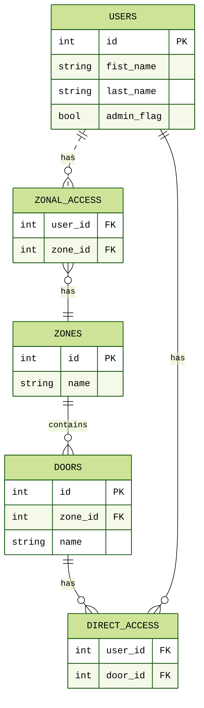
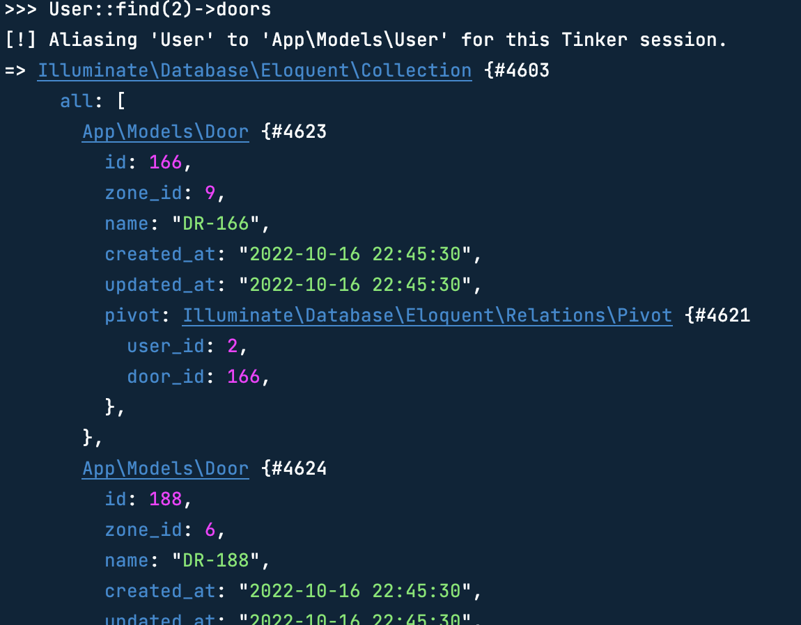
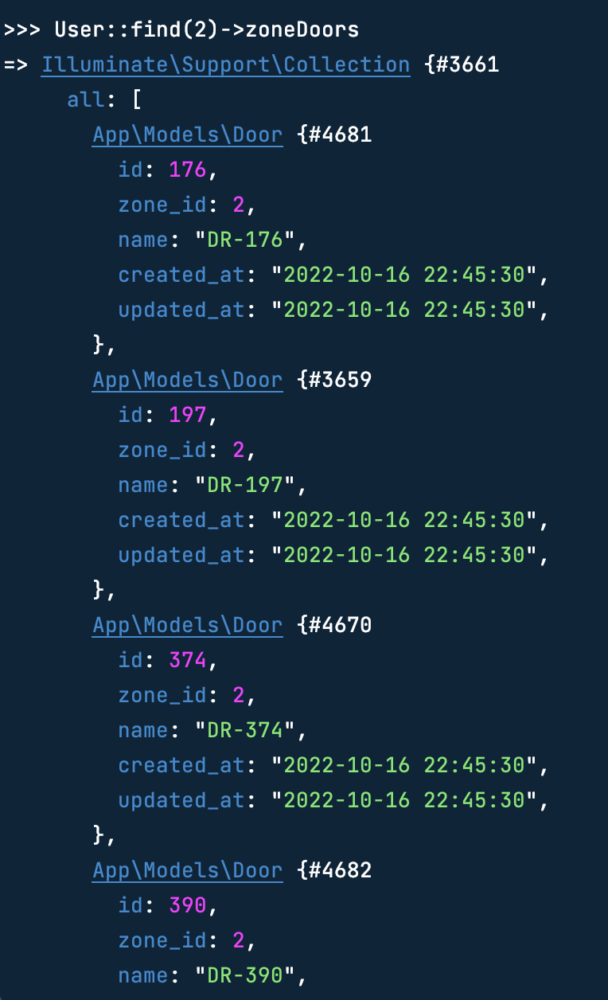

<div align="center">
    <h1 align="center" style="color:darkgoldenrod; font-family: verdana;">
        Peppero Locks
    </h1>
    <div></div>
    <a href="https://github.com/micahdougall/peppero-locks">
        
    </a>
    <div>&#128540;</div>
</div>

# tl;dr 

This README details the model relations and functionality included in *Peppero-Locks*.

All class files are completed and adequately commented, so this document is purely supplementary.

Screenshots from the `php artisan tinker` CLI can be seen in the final section of this readme.

The full project repository can be found on [GitHub](https://github.com/micahdougall/peppero-locks).


<!-- TOC -->
* [Entity Relationship Diagram](#entity-relationship-diagram)
* [Explicit access](#explicit-access)
* [Zonal Access](#zonal-access)
* [Admin access](#admin-access)
* [`hasAccessToDoor()`](#hasaccesstodoor)
* [User expiry](#user-expiry)
* [Transitive relationships (`HasManyThrough`)](#transitive-relationships--hasmanythrough-)
* [References](#references)
* [Tinker screenshots](#tinker-screenshots)
<!-- TOC -->


[//]: # (## Entity Relationship Diagram <a name="entity-relationship-diagram"></a>)
### Entity Relationship Diagram


### Explicit access

Access can be provided to a user by adding a record to the `direct_access` table. As this is a many-to-many relationship (many users could have direct access to the same door), an additional `direct_access` table is used to store these associations (see [create_doors_users_table](database/migrations/2022_10_16_173437_create_doors_users_table.php)).

```php
/** Check which doors the first user has access to */
$user = User::first();
$user->doors;

/** Add explicit access to the first door */
$user->doors()->attach(Door::first());

/** Or using the provided method */
$user->addAccessToDoor(Door::first());
```

### Zonal Access

Once again, the relationship between Doors and Zones is a many-to-many relationship, so an additional *pivot* table, `zonal_access` stores these relations (see [create_users_zones_table](database/migrations/2022_10_16_173437_create_doors_users_table.php)).

The database has been seeded with 10 zones, 1 of which contains no doors (Zone 1) and one of which has no zonal access given to any users (Zone 10).

```php
/** Get a collection of doors assigned to Zone 1 */
Zone::find(1)->doors

/** Identify all users which have access to Zone 10 */
Zone::find(10)->users
```


User::where('id', 2)->get()
Zone::find(1)->doors
Door::first()->zone->users

### Admin access

Admin users have access to all doors implicitly, which can be shown by supplying any [Door](App/Models/Door.php) to the `hasAccessToDoor()` method (see [below](#hasaccesstodoor)).

This does not mean that all doors wil be returned by the `doors` and `zoneDoors` properties (which return explicitly accessible doors and zonally accessible doors respectively).

```php
/** Check if user with id 5 is an admin */
User::find(5)->isAdmin()

/** Update user with id 6 to be an admin */
User::query()->where('id', 5)->update(['admin_flag' => true]);
```


### `hasAccessToDoor()`

This method indicates whether a user has access to a supplied door, through either:
- Direct access (`direct_access` table) &#8594; verified via the `doors` property in [User](App/Models/User.php).
- Zone access (`zonal_access` table) &#8594; verified via the `zoneDoors` property in [User](App/Models/User.php).
- Admin rights (`users.admin_flag == true`) &#8594; checked using the `isAdmin()` method in [User](App/Models/User.php).


```php
/** Update user with id 6 to be an admin */
User::find(1)->hasAccessToDoor(Door::find(616))

/** Update user with id 6 to be an admin */
User::find(1)->hasAccessToDoor(Door::find(711))

/** Update user with id 6 to be an admin */
User::firstWhere('admin_flag', false)->zoneDoors
```

### User expiry

All users must include a value for `expiry_date`, after which point they will not be able to access any doors, regardless of their admin status.

```php
/** Check if the first User is active */
User::first()->isActive()

/** Manually expire a User */
User::find(3)->expire()
```

### Transitive relationships (`HasManyThrough`)

The doors that can be accessed by a given user through *zone*-access can be listed using the `zoneDoors` property in User.

Except for the many-to-amy relationship between zones and users, this would be accessed using a `HasManyThrough` Eloquent relationship, but because of the many-to-many relationship, there is instead a manual implementation.

```php
/** Get doors which are explicitly accessible for user with id 2 */
User::find(2)->doors

/** Get doors from all zones which user with id 2 has access to */
User::find(2)->zoneDoors
```

This latter property would be similar to a SQL query like:

```MySQL
SELECT
     a.user_id
    ,d.zone_id
    ,d.id AS door_id
    ,d.name
FROM doors d
INNER JOIN zonal_access a
    ON d.zone_id = a.zone_id
WHERE a.user_id = 2
ORDER BY zone_id, door_id;
```

### References

PHPDocs and other conventions have been taken from [IxFD](https://handbook.interaction-design.org/development/library/back-end/conventions--php.html#docblocks).

### Tinker screenshots




