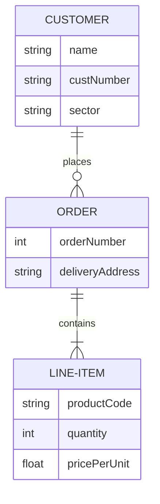

<h1 align="center" >
    <a href="https://github.com/micahdougall/peppero-locks" style="color:darkgoldenrod; font-family: verdana;">
        Peppero Locks
    </a>
</h1>
<p align="center">
    <a href="https://github.com/micahdougall/peppero-locks" target="_blank">
        
    </a>
</p>

<p align="center">
<a href="https://github.com/micahdougall/peppero-locks"></a>

[//]: # (<a href="https://packagist.org/packages/laravel/framework"></a>)
[//]: # (<a href="https://packagist.org/packages/laravel/framework"></a>)
[//]: # (<a href="https://packagist.org/packages/laravel/framework"></a>)
</p>

<!-- TOC -->
* [Main title](#main-title)
    * [Subtitle](#subtitle)
    * [Another subtitle](#another-subtitle)
* [Another main title](#another-main-title)
    * [Secondary subtitle](#secondary-subtitle)
        * [Third level header](#third-level-header)
<!-- TOC -->


# peppero-locks

https://github.com/micahdougall/peppero-locks

https://handbook.interaction-design.org/development/library/back-end/conventions--php.html#final-by-default
https://www.php.net/manual/en/functions.arguments.php#functions.arguments.type-declaration




User::where('id', 2)->get()
Zone::find(1)->doors
Door::first()->zone->users

Has many through:

```PHP
User::find(2)->zones->first()->doors
Zone::find(1)->doors
User::find(2)->doors


User::find(1)->hasAccessToDoor(Door::find(616))
User::find(1)->hasAccessToDoor(Door::find(711))

User::firstWhere('admin_flag', false)->zoneDoors

User::find(2)->doors


```

```MySQL
SELECT
     a.user_id
    ,d.zone_id
    ,d.id AS door_id
    ,d.name
FROM doors d
INNER JOIN user_access a
    ON d.zone_id = a.zone_id
WHERE a.user_id = 2
ORDER BY zone_id, door_id;
```


## TODO: 
- Finished readme

