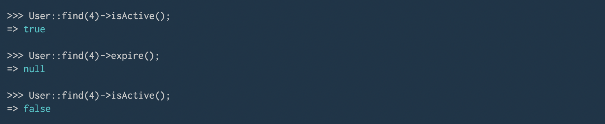
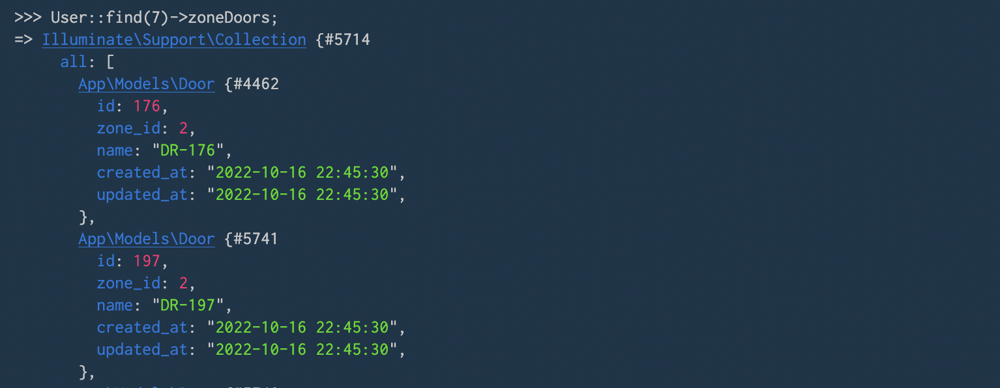

<div align="center">
    <h1 align="center" style="color:darkgoldenrod; font-family: verdana;">
        Peppero Locks
    </h1>
    <div></div>
<hr>
    <a href="https://github.com/micahdougall/peppero-locks">
        
    </a>

[//]: # (    <div>&#128540;</div>)
</div>

# tl;dr 

This README.md details the Eloquent Model relationships and functionality included in *Peppero Locks*. It is best rendered in an IDE which provides links to classes and migrations (contents page links will work in VSCode but not PHPStorm).

**All class files are completed and adequately commented, so this document is an optional read.**

Screenshots from the `php artisan tinker` CLI can be seen in the final section of this readme.

The full project repository can also be found on [GitHub](https://github.com/micahdougall/peppero-locks). Access to the private repository has been granted to `RGayaSU`.


<!-- TOC -->
* [Entity Relationship Diagram](#entity-relationship-diagram)
* [Functionality](#functionality)
  * [Explicit access](#explicit-access)
  * [Zonal Access](#zonal-access)
  * [Admin access](#admin-access)
  * [`hasAccessToDoor()` method](#hasaccesstodoor-method)
  * [User expiry](#user-expiry)
  * [Transitive relationships (`HasManyThrough`)](#transitive-relationships-hasmanythrough)
* [References](#references)
* [Tinker screenshots](#tinker-screenshots)
<!-- TOC -->


[//]: # (## Entity Relationship Diagram <a name="entity-relationship-diagram"></a>)
# Entity Relationship Diagram

The ERD digram below shows the pivot tables used for the model along with primary and foreign key constraints.


<br>

# Functionality

<br>

## Explicit access

As the relationship between Users and Doors is a many-to-many relationship (many users could have direct access to the same door), an additional `direct_access` pivot table is used to store these associations (see [create_doors_users_table](database/migrations/2022_10_16_173437_create_doors_users_table.php)).

Access to a Door can therefore be provided to a User by adding a record to the `direct_access` table. This can either be done via Eloquent's `attach` method, or using the `addAccessToDoor` method in the [User](App/Models/User.php) class. 

In the [UserSeeder](Database/Seeders/UserSeeder.php), this has been done for User with id 2:

```php
/** Get an active non-admin user and check for explcit door access */
>>> $user = User::query()
            ->where([
                ['admin_flag', false],
                ['expiry_date', '>', '2022-12-01']
            ])
            ->first();

=> App\Models\User {#4620
     id: 2,
     first_name: "Ashlynn",
     last_name: "Wintheiser",
     admin_flag: 0,
     expiry_date: "2023-10-03",
     created_at: "2022-10-16 22:45:30",
     updated_at: "2022-10-16 22:45:30",
   }

>>> $user->doors;

=> Illuminate\Database\Eloquent\Collection {#4660
     all: [
       App\Models\Door {#4696
         id: 166,
         zone_id: 9,
         name: "DR-166",
         created_at: "2022-10-16 22:45:30",
         updated_at: "2022-10-16 22:45:30",
         pivot: Illuminate\Database\Eloquent\Relations\Pivot {#4694
           user_id: 2,
           door_id: 166,
         },
       },

    ...

       App\Models\Door {#4715
         id: 971,
         zone_id: 10,
         name: "DR-971",
         created_at: "2022-10-16 22:45:30",
         updated_at: "2022-10-16 22:45:30",
         pivot: Illuminate\Database\Eloquent\Relations\Pivot {#4615
           user_id: 2,
           door_id: 971,
         },
       },
     ],
   }

/** Find doors for a user without explicit access */
>>> User::find(8)->doors;

=> Illuminate\Database\Eloquent\Collection {#4735
     all: [],
   }

/** Add explicit access and verify */
>>> User::find(8)->addAccessToDoor(Door::first());

=> null

>>> User::find(8)->doors;

=> Illuminate\Database\Eloquent\Collection {#4730
     all: [
       App\Models\Door {#4729
         id: 166,
         zone_id: 9,
         name: "DR-166",
         created_at: "2022-10-16 22:45:30",
         updated_at: "2022-10-16 22:45:30",
         pivot: Illuminate\Database\Eloquent\Relations\Pivot {#4746
           user_id: 8,
           door_id: 166,
         },
       },
     ],
   }
```

<br>

## Zonal Access

Once again, the relationship between Users and Zones is a *many-to-many* relationship, so an additional *pivot* table, `zonal_access` stores these relations (see [create_users_zones_table](database/migrations/2022_10_15_095419_create_users_zones_table.php)).

The database has been seeded with 10 zones using the [ZoneSeeder](Database/Seeders/ZoneSeeder.php) class, 1 of which contains no doors (Zone 1) and one of which has no zonal access given to any users (Zone 10).

The [Zones](App/Models/Zone.php) class shows the related Doors and Users via `doors` and `users` properties respectively:

```php
/** Get a collection of doors assigned to Zone 2 */
>>> Zone::find(2)->doors;

=> Illuminate\Database\Eloquent\Collection {#4718
     all: [
       App\Models\Door {#4716
         id: 176,
         zone_id: 2,
         name: "DR-176",
         created_at: "2022-10-16 22:45:30",
         updated_at: "2022-10-16 22:45:30",
       },
       App\Models\Door {#4618
         id: 197,
         zone_id: 2,
         name: "DR-197",
         created_at: "2022-10-16 22:45:30",
         updated_at: "2022-10-16 22:45:30",
       },

    ...

       App\Models\Door {#4754
         id: 816,
         zone_id: 2,
         name: "DR-816",
         created_at: "2022-10-16 22:45:30",
         updated_at: "2022-10-16 22:45:30",
       },
     ],
   }


/** Identify all users which have access to Zone 9 */
>>> Zone::find(9)->users;

=> Illuminate\Database\Eloquent\Collection {#4718
     all: [
       App\Models\User {#4736
         id: 1,
         first_name: "Sabrina",
         last_name: "Okuneva",
         admin_flag: 1,
         expiry_date: "2026-05-11",
         created_at: "2022-10-16 22:45:30",
         updated_at: "2022-10-16 22:45:30",
         access: Illuminate\Database\Eloquent\Relations\Pivot {#4749
           zone_id: 9,
           user_id: 1,
           created_at: "2022-10-16 22:45:30",
           updated_at: "2022-10-16 22:45:30",
         },
       },

    ... 

       App\Models\User {#4759
         id: 10,
         first_name: "Pamela",
         last_name: "Terry",
         admin_flag: 0,
         expiry_date: "2025-05-29",
         created_at: "2022-10-16 22:45:30",
         updated_at: "2022-10-16 22:45:30",
         access: Illuminate\Database\Eloquent\Relations\Pivot {#4719
           zone_id: 9,
           user_id: 10,
           created_at: "2022-10-16 22:45:30",
           updated_at: "2022-10-16 22:45:30",
         },
       },
     ],
   }
```

Note that in the [DoorSeeder](Database/Seeders/DoorSeeder.php) class, Zone 1 is skipped from attaching any doors.

Meanwhile, in the [UserSeeder](Database/Seeders/UserSeeder.php) class, Zone 10 is skipped from attaching any users to.

<br>

## Admin access

Admin rights can be determined via the `isAdmin` method in the [User](App/Models/User.php) class. 

Admin users have access to all doors implicitly, which can be shown by supplying any [Door](App/Models/Door.php) to the `hasAccessToDoor` method (see next section [below](#hasaccesstodoor-method)).

This does not mean that for Admin users, *all* doors wil be returned by the `doors` and `zoneDoors` properties (which will return just the explicitly accessible doors and zonally accessible doors respectively).

```php
/** Check if user with id 5 is an admin */
>>> User::find(5)->isAdmin();

=> true

/** Update user with id 6 to be an admin */
>>> User::query()->where('id', 6)->update(['admin_flag' => true]);

=> 1
```

In the [UserSeeder](Database/Seeders/UserSeeder.php) class, User 1 and User 5 are given admin rights.

<br>

## `hasAccessToDoor` method

This method in the [User](App/Models/User.php) class groups together the three possible kinds of door access to indicate whether a user has access to a supplied Door, through any of:
- Direct access (`direct_access` table) &#8594; verified via the `doors` property.
- Zone access (`zonal_access` table) &#8594; verified via the `zoneDoors` property.
- Admin rights (`users.admin_flag == true`) &#8594; checked using the `isAdmin` method.

*NB: If re-seeding the database, the following Door ids will be invalid.*

```php
/** Verify that user 8 has access to to door from excplicit access*/
>>> User::find(8)->hasAccessToDoor(Door::find(166));

=> true

/** Verify that admin user has access via non-zonal access  */
>>> User::find(5)->hasAccessToDoor(Door::find(927));

=> true

/** Verify that user has access via zonal access */
>>> User::find(2)->hasAccessToDoor(Door::find(789));

=> true

/** Verify that an expired user doesn't have access to doors */
>>> User::find(3)->isActive();

=> false

>>> User::find(3)->zoneDoors;

=> Illuminate\Support\Collection {#4608
     all: [
       App\Models\Door {#4639
         id: 176,
         zone_id: 2,
         name: "DR-176",
         created_at: "2022-10-16 22:45:30",
         updated_at: "2022-10-16 22:45:30",
       },

    ...
    
    ]
}

>>> User::find(3)->hasAccessToDoor(Door::find(176));

=> false
```

<br>

## User expiry

All users must include a value for `expiry_date`, after which point they will not be able to access any doors, regardless of their admin status.

The status of a user can be checked using the `isActive` method in the [User](App/Models/User.php) class, and *manually* expired using  the `expire` method.

```php
/** Manually expire an active user */
>>> User::find(4)->isActive();

=> true

>>> User::find(4)->expire();

=> null

>>> User::find(4)->isActive();

=> false
```

<br>

## Transitive relationships (`HasManyThrough`)

The Eloquent `HasManyThrough` class is not compatible with a *many-to-many* relationship as we have with Zones and Users. 

Therefore, to show the transitive relationships, the `zoneDoors` property in the [User](App/Models/User.php) class is a manual implementation which combines the lists of doors that can be accessed by a given user through *zone*-access. 

```php
/** Get the zones which user 7 can access */
>>> User::find(7)->zones;

=> Illuminate\Database\Eloquent\Collection {#5681
     all: [
       
    ...

       App\Models\Zone {#5698
         id: 2,
         name: "Zone 2",
         created_at: "2022-10-16 22:45:30",
         updated_at: "2022-10-16 22:45:30",
         access: Illuminate\Database\Eloquent\Relations\Pivot {#5695
           user_id: 6,
           zone_id: 2,
           created_at: "2022-10-16 22:45:30",
           updated_at: "2022-10-16 22:45:30",
         },
       },

    ...

     ],
   }


/** Get the doors which zone 2 includes */
>>> Zone::find(2)->doors;

=> Illuminate\Database\Eloquent\Collection {#5678
     all: [
       
    ...

       App\Models\Door {#5686
         id: 197,
         zone_id: 2,
         name: "DR-197",
         created_at: "2022-10-16 22:45:30",
         updated_at: "2022-10-16 22:45:30",
       },

    ...

     ],
   }

/** Verify that these doors are included in zoneDoors */
>>> User::find(7)->zoneDoors;

=> Illuminate\Support\Collection {#5714
     all: [
    
    ...

       App\Models\Door {#5741
         id: 197,
         zone_id: 2,
         name: "DR-197",
         created_at: "2022-10-16 22:45:30",
         updated_at: "2022-10-16 22:45:30",
       },

    ...

     ],
   }
```

The `zoneDoors` property would be similar to a list of door_ids from the SQL query:

```MySQL
SELECT
     a.user_id
    ,d.zone_id
    ,d.id AS door_id
    ,d.name
FROM doors d
INNER JOIN zonal_access a
    ON d.zone_id = a.zone_id
WHERE a.user_id = 2
ORDER BY zone_id, door_id;
```

<br>

## References

* PHPDocs and other conventions have been taken from [IxFD System PHP Conventions](https://handbook.interaction-design.org/development/library/back-end/conventions--php.html#docblocks).
* Notes on Accessor properties from [Laravel.com](https://laravel.com/docs/9.x/eloquent-mutators#accessors-and-mutators).
<br>

## Tinker screenshots

* [Explicit access](#explicit-access)


* [Zonal Access](#zonal-access)


* [Admin access](#admin-access)


* [`hasAccessToDoor()` method](#hasaccesstodoor-method)


* [User expiry](#user-expiry)


* [Transitive relationships (`HasManyThrough`)](#transitive-relationships-hasmanythrough)

